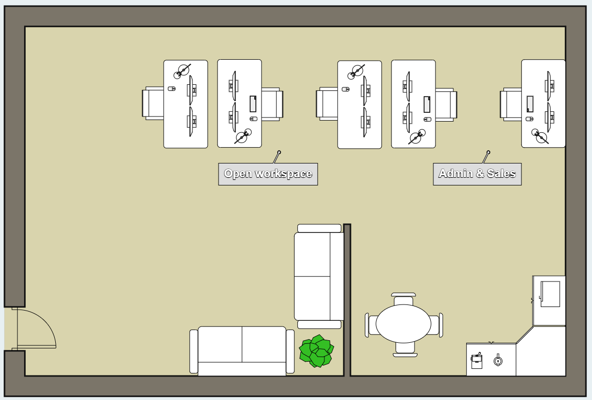
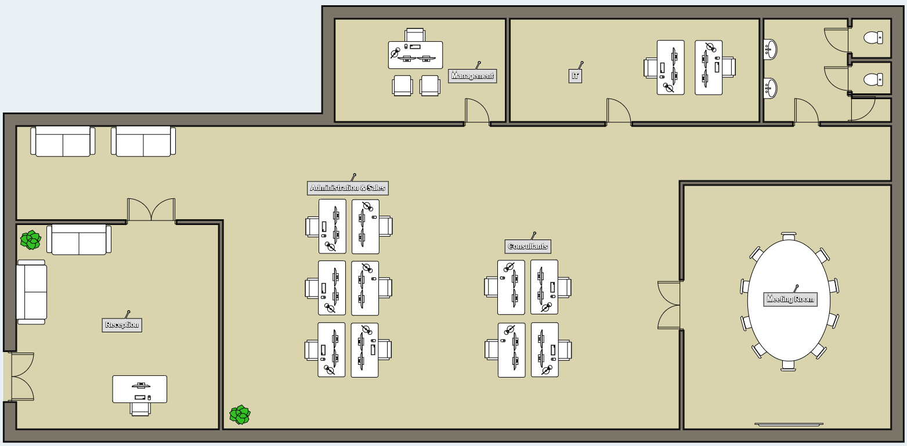

# Floor Plans

I drew out 2 floor plans, one for Gent and one for Aalst. I will use these for making a quote for the network cables and as the background in packet tracer; the networking part of this project.

<figure><figcaption>
Floor plan Aalst
</figcaption></figure>

 

<figure><figcaption>
Floor plan Gent
</figcaption></figure>

The site in Gent consist of 25 workstation (not all of these are drawn on the floor plan) and 6 rooms: Administration & Sales, IT, Management, Meeting Room, Reception and Consultants. The much smaller site in Aalst consist of 5 workstation and 2 rooms: an open workspace and Admin & Sales. I also added a small kitchen and a sitting area.
