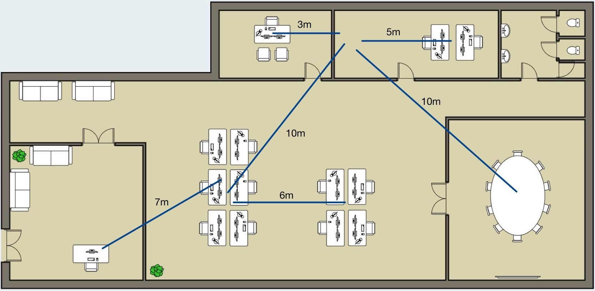

# Quote - Cables

On both of out site we will need to cable the network. I decided to go with CAT5e cabling beacause it offers support for Gigabit Ethernet speeds of up to 1000 Mbps, a bandwidth of 350 MHz and backwards compatibility with standard Cat5 cables.

At first we need to calculate the lenght that we need. I measured the bird eye's view from the starting point, point A, to the destination point B. In the calculation we are considering a few things:

* The switches that aren't located in the server room will be in the ceiling or close to the ceiling.
* The switches in the server room will be in a server rack, I account for approx. 5m to the switch, from the ceiling.
* It's feasible that we only have certain points to enter through the wall, so we can't calculate with the bird eye's view only.

### Calculating cable lenght: Site Gent

<figure><figcaption>
Bird eye view's at Site Gent
</figcaption></figure>

We have a couple cables to run:

<table><thead><tr><th>Point A</th><th>Point  B</th><th data-type="number">Lenght in m (BEV)</th><th>Cable count</th></tr></thead><tbody><tr><td>Reception</td><td>Admin &#x26; Sales (switch)</td><td>7</td><td>2</td></tr><tr><td>Consultants</td><td>Admin &#x26; Sales (switch)</td><td>6</td><td>2</td></tr><tr><td>Admin &#x26; Sales</td><td>Server Room</td><td>10</td><td>2</td></tr><tr><td>Meeting Room</td><td>Server Room</td><td>10</td><td>2</td></tr><tr><td>Management</td><td>Server Room</td><td>3</td><td>2</td></tr><tr><td>IT</td><td>Server Room</td><td>5</td><td>2</td></tr></tbody></table>

Now we have the lenghts and the cable counts (how many cables need to be run); this is important for future proofing, EtherChannels, ... . We will calculate a 20% slack for cable termination and a 15% slack because we only have certain points of entry through the wall.

Formula (x = cable lenght, y = cable count): (x \* y) + (0.20 \* x \* y) + (0.15 \* x \* y)\
We will need to add 5 when we go to the server room

Reception -> Admin & Sales: (7 \* 2) + (0.20 \* 7 \* 2) + (0.15 \* 7 \* 2) = 16.45m\
Consulants -> Admin & Sales: (6 \* 2) + (0.20 \* 6 \* 2) + (0.15 \* 6 \* 2) = 14.1m\
Admin & Sales -> Server Room: (10 \* 2) + (0.20 \* 10 \* 2) + (0.15 \* 10 \* 2) + 5 = 28.5m\
Meeting Room -> Server Room: (10 \* 2) + (0.20 \* 10 \* 2) + (0.15 \* 10 \* 2) + 5 = 28.5m\
Management -> Server Room: (3 \* 2) + (0.20 \* 3 \* 2) + (0.15 \* 3 \* 2) + 5 = 14.05m\
IT -> Server Room: (5 \* 2) + (0.20 \* 5 \* 2) + (0.15 \* 5 \* 2) + 5 = 16.75m

Because of the implementation of access point we are going to need more, so we will take this into account by adding 50m more cable.

The final cable lenght needed in the Site of Gent is: 118,35m + 50m = \~170m

### Calculating cable lenght: Site Aalst

In Aalst, the server is located in a small server rack in the outer left corner of the office.

<table><thead><tr><th>Point A</th><th>Point B</th><th>Lenght in m (BEV)</th><th data-type="number">Cable count</th></tr></thead><tbody><tr><td>Open workspace</td><td>Server Rack</td><td>7</td><td>2</td></tr><tr><td>Admin &#x26; Sales</td><td>Server Rack</td><td>8</td><td>2</td></tr></tbody></table>

Again, we keep in mind the slack and we have 2 cables to run. Because we have no walls between the server rack and the office itself, we don't need to have the 15% slack.

Open Workspace -> Server Rack: (7 \* 2) + (0.20 \* 7 \* 2) = 16.8m\
Admin & Sales -> Server Rack: (8 \* 2) + (0.20 \* 8 \* 2) = 19.2m

Implentation of access points require around 25m extra.

The final cable lenght needed in the Site of Gent is: 36m + 25m = \~61m

### Quote

I also asked a quote for 4 small networking closest for mounting the networking hardware (ceiling or wall).

<figure><figcaption>
Quote for all the cables
</figcaption></figure>



