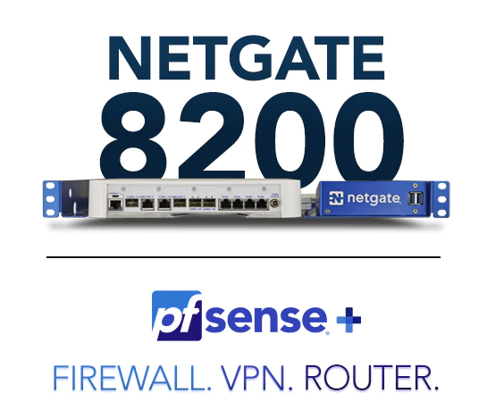
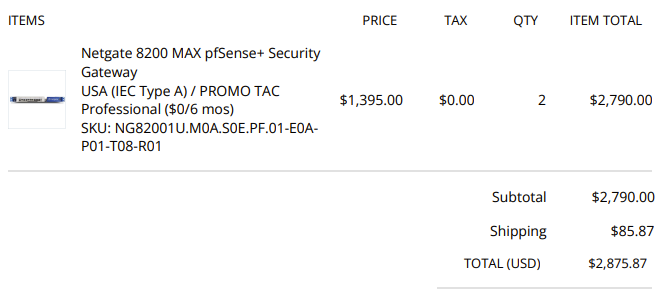

# Quote - Firewall

For the firewall we are using PfSense on both sites. The company behind PfSense is Netgate and they sell their own hardware to run pfsense. So I decided to go with one of their own firewall's.

We have a lot of options ranging from a cloud hosted solution to a Netgate 1100 (1.2 GHz 2-Core, 1 GB DDR4) to a Netgate 1541 (2.1 GHz 8-Core, 16 GB DDR4). I picked a mid-class firewall, the Netgate 8200 which has a Intel Atom 2.4 GHz 8-Core CPU, 16 GB DDR4 and 128 GB NVMe memory. This is more than enough for what I need it for and supports VPN (IPSEC).

<figure><figcaption>
The Netgate 8200 firewall
</figcaption></figure>

<figure><figcaption>
Quote Netgate
</figcaption></figure>
