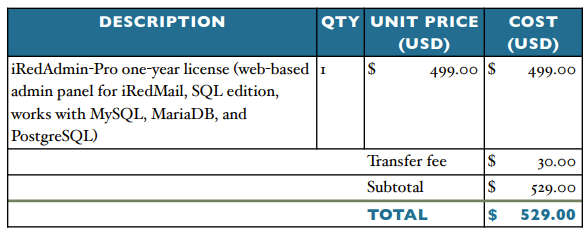

# Quote - Mail Software

One of the more simpler quotes is the mailing software iRedMail. iRedMail is an Open Source Mail Server Solution that runs on linux. There is a free version to download that includes: Localized Web Interface, Unlimited Mail Domains and Mail Users.

The paid/pro version offers more capablities: RESTful API Interface, Unlimited Mailing List/Aliases, Unlimited Domain-Level Admins, Advanced Domain Management, Advanced User Management, Self-Service, Service Control, Spam/Virus Quarantining, View basic info of all sent and received emails, Throttling, Whitelisting, Blacklisting, Searching Account, Log Maildir Path of Deleted Dail User, Log Admin Activities, Fail2ban Integration, Last login track, Export all managed mail accounts and Export statistics of admins. Some of these capablities we can't afford to miss (White- and blacklisting, Spam/Virus Quarantining, ...)

<figure><figcaption>
Quote iRedMail
</figcaption></figure>
