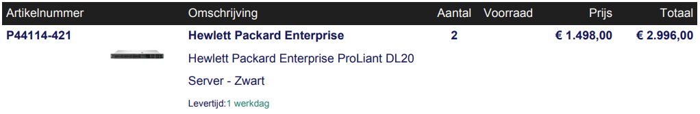
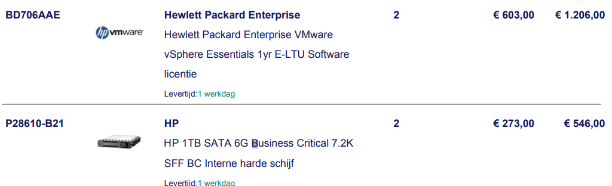
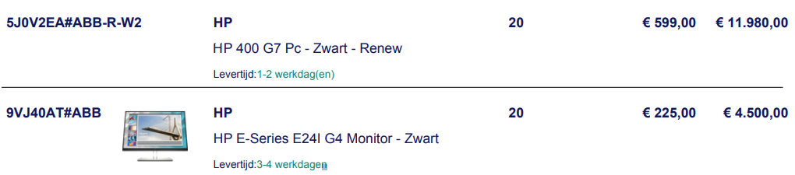

# Quote - Server and Clients

## Server

For the server, we chose the Hewlett Packard Enterprise (HPE) ProLiant DL20. It comes equipped with an Intel Xeon E processor that runs at 2.8 GHz and an 16 GB of DDR4-SDRAM that can be upgraded up to 64 GB of DDR4 with the use of it's 4 DIMM slots, providing more than enough memory for hosting the VMs and vSphere. It's housed in a 1U rack, making it easy to integrate into our existing infrastructure and existing rack.

* Processor: Intel Xeon E-2134, with a clock speed of 2.8 GHz.
* Memory: 16 GB of DDR4-SDRAM, with 1 x 16 GB module installed.
* Ethernet: Includes built-in Ethernet connectivity.
* Power supply: Comes with a 500 W power supply, with redundancy available.
* Form factor: Rack-mountable design that occupies 1U of rack space.

The server is powerful enough to host a variety of applications, including mail, domain controller, and file server. For the sake of reliability, we may opt to run certain services on separate hardware, such as file shares, ... . Nonetheless, the HPE ProLiant DL20 is an excellent choice for our needs, providing robust performance and a reliable foundation for our IT infrastructure.

<figure><figcaption>
Server Quote
</figcaption></figure>

I also ordered VMWare vSphere licenses and 2 HP 1TB SATA 6G Business Critical 7.2K hard drives for storing data.

<figure><figcaption>
Server HDD and license Quote
</figcaption></figure>

## Clients

The HP 250 G9 Laptop is a reliable and affordable laptop that is great for our usecase. It features a 15.6-inch display, an Intel Core i5 processor, and 8GB of RAM, making it suitable our users. It also has a 512GB SSD for fast boot and load times. The laptop runs on Windows 11 Pro, and comes with a built-in webcam and microphone.

<figure><figcaption>
Laptop Quote
</figcaption></figure>

On the other side, we ordered an HP 400 G7 PC as a workstation for the office. The HP 400 G7 is a business desktop computer. It features an Intel Core i5-10500 processor, 8GB of DDR4-2666 RAM, and a 256GB SSD, which provides enough space for basic software and storage needs. The PC is equipped with multiple USB ports, DisplayPort, HDMI, and Ethernet, which make it suitable for any business use. Additionally, it has a compact design that saves space and fits perfectly in any office environment. We chose the HP 400 G7 for its outstanding performance, ease of use, and reliability, making it an ideal choice for a secondary workstation in our remote office.

<figure><figcaption>
Workstation Quote
</figcaption></figure>
