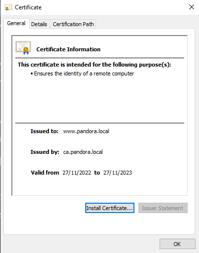
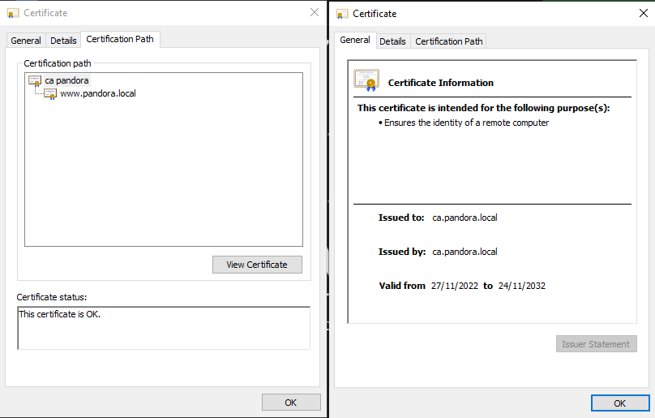

# Site Certificate


All of the transferring of the files between the CA and site servers are done by NFS-common.


Now the CA is set up, the site can request its own certificate. On the site server the following command will requests its certificate (certificate request).

Let's break down the command:\
**openssl req:** makes a new request\
**-new:** new request\
**-newkey rsa:2048:** creates a new 2048-bit RSA key\
**-keyout:** outputs the key file\
**-out:** outputs the request file. We need this particular file to be signed by the CA

```shell
openssl req -new -newkey rsa:2048 -nodes -keyout pandora.local.key 
-out pandora.local.csr
```

After this command is executed, we'll be asked for the same information as before when we made a certificate for the CA itself.

Country Name (2 letter code) \[AU]:**BE**\
State or Province Name (full name) \[Some-State]:**Oost-Vlaanderen**\
Locality Name (eg, city) \[]:**Aalst**\
Organization Name (eg, company) \[Internet Widgits Pty Ltd]:**PANDORA**\
Organizational Unit Name (eg, section) \[]:\
Common Name (e.g. server FQDN or YOUR name) \[]:**pandora.local**\
Email Address \[]:**admin@pandora.local**

On the CA server, we sign the request made on the site server. Notice that we are using the 'ca' command module. This is a automated script that will be executed by openssl to sign the request with all the information in the openssl configuration file.&#x20;

```
openssl ca -in exampledomain.com.csr -out exampledomain.com.crt
```

Now, the certificate is signed and can be transfered back to the site server. When we browse to the site on a windows machine we will see the certificate.&#x20;


Because our CA is not a trusted Authority, browsers will label the website as untrusted. After importing the CA root certificate in the local group policy, IE will trust this.

Keep in mind that this is a temporary solution as we will implement this in a GPO later on.


<div>

<figure><figcaption><p>Site certificate signed</p></figcaption></figure>

 

<figure><figcaption><p>Certificate path &#x26; self-signed certificate</p></figcaption></figure>

</div>
