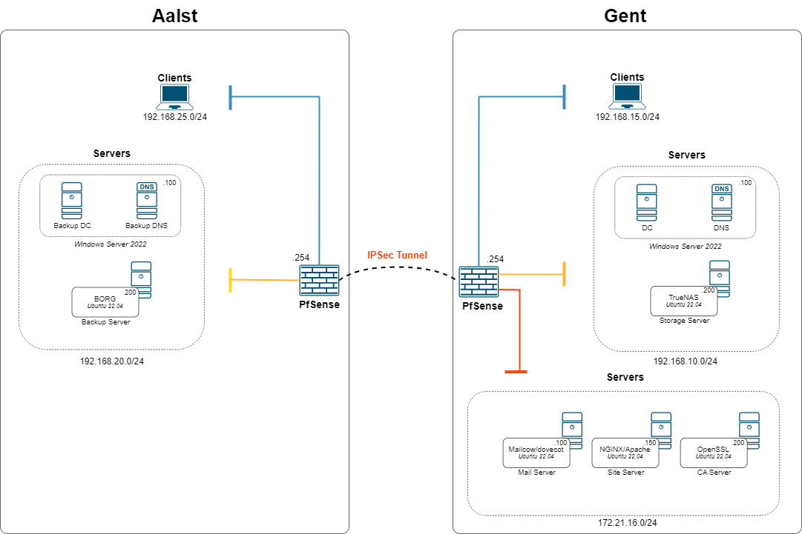

# Network Architecture

After deciding the approach, we needed a network diagram. In this diagram we implemented the servers with the desired IP address, OS and software used.

<figure><figcaption>
Network Architecture
</figcaption></figure>

One thing you can clearly see in the architecture is the use of 3 zones: Client, Servers and DMZ. This design is critical for security, this will be further explained in the next step (firewalling and VPN).

The 3 zones each have a different subnet, I always choose a /24 subnet mask because of easy management. The last IP address is always the gateway to the PFsense router.

## The wrong decision: Docker

I've experienced with docker to use in my project because, as you can see, 3 servers in the DMZ are based on Ubunte 22.04. So I thought it was a great decision to choose docker; less hardware usage and 3 light services in one server. But once I started I realized that I needed to design the docker file's for it and didn't really have a true advantage in the real world. More so, it is rarely used in a production enviroment. Deciscion: go with 3 separate Linux based machines.
