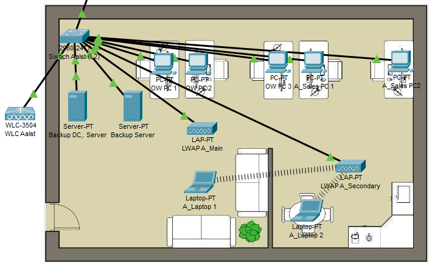

# Network Site Aalst

This network is a trimmed down version of the one in Gent. It only has one switch with VLAN's, a wireless network (WLC & 2 LWAP), backup servers and 5 workstations. The workstations will mostly connect to the servers on the site of Gent because there are the primary servers. But they will use the local DNS and DHCP server.

<figure><figcaption>
Network Site Aalst
</figcaption></figure>
