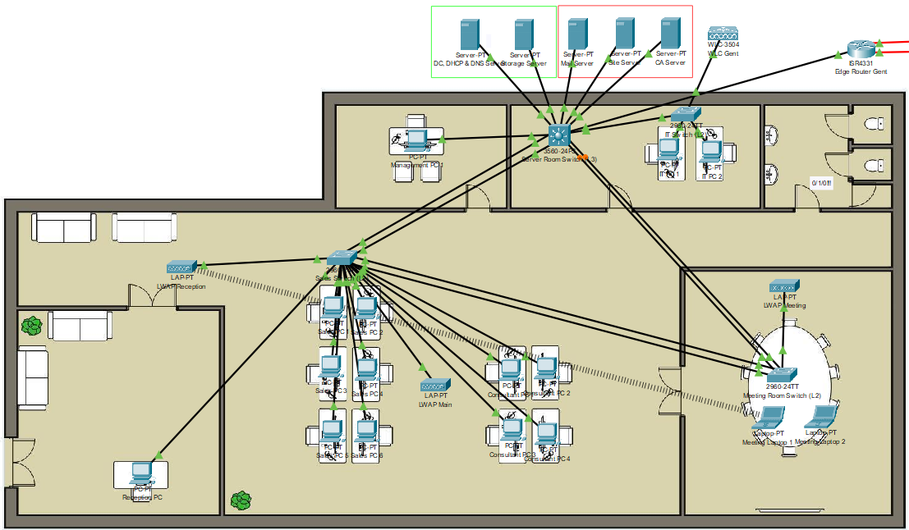
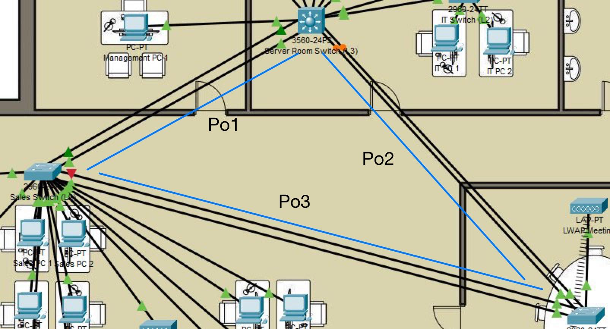
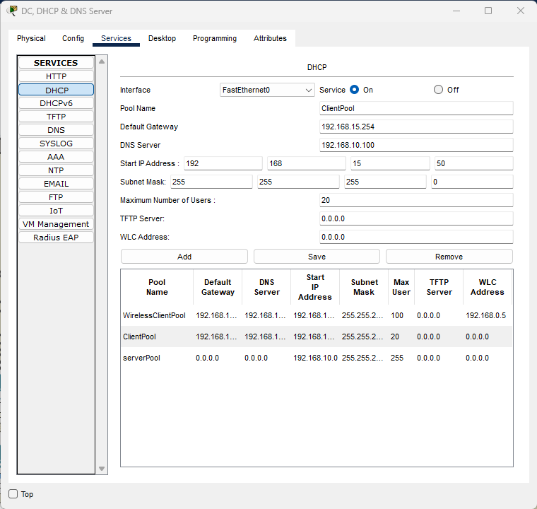
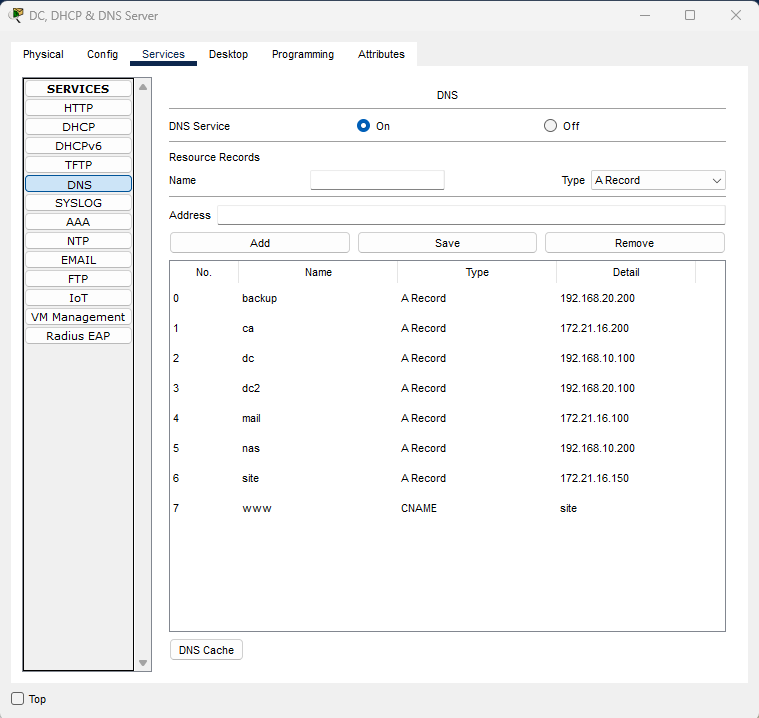
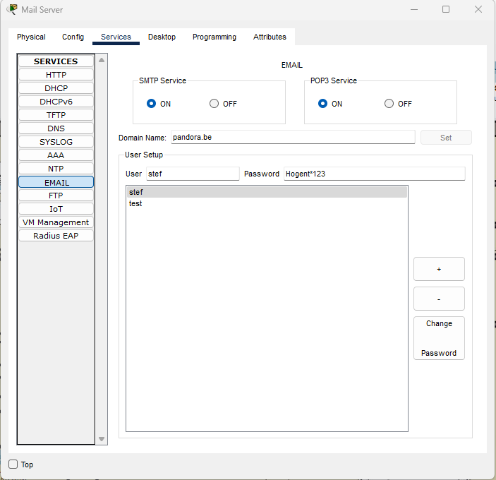
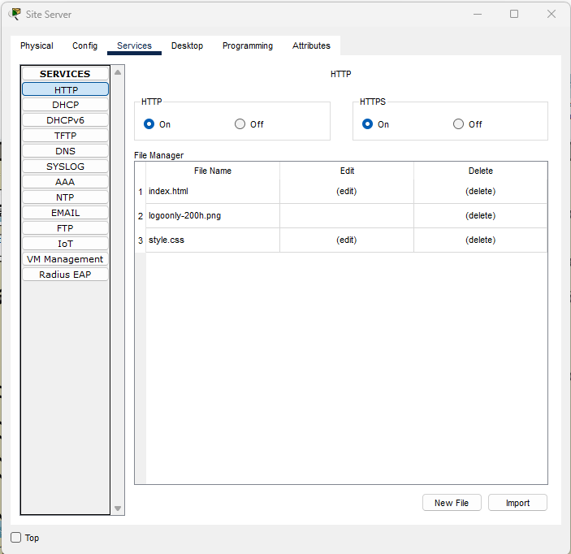
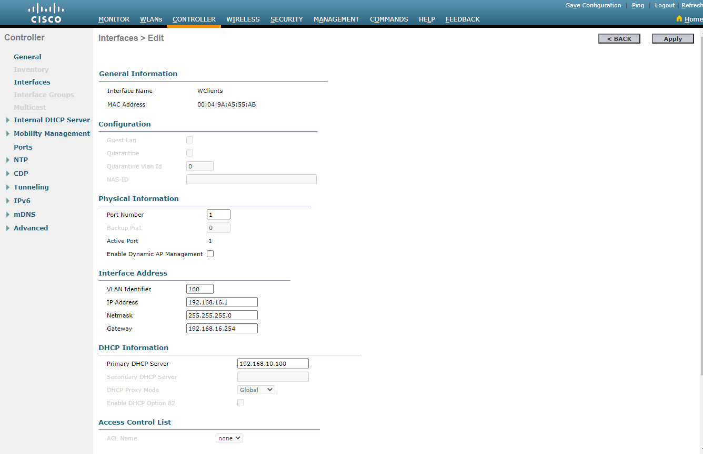
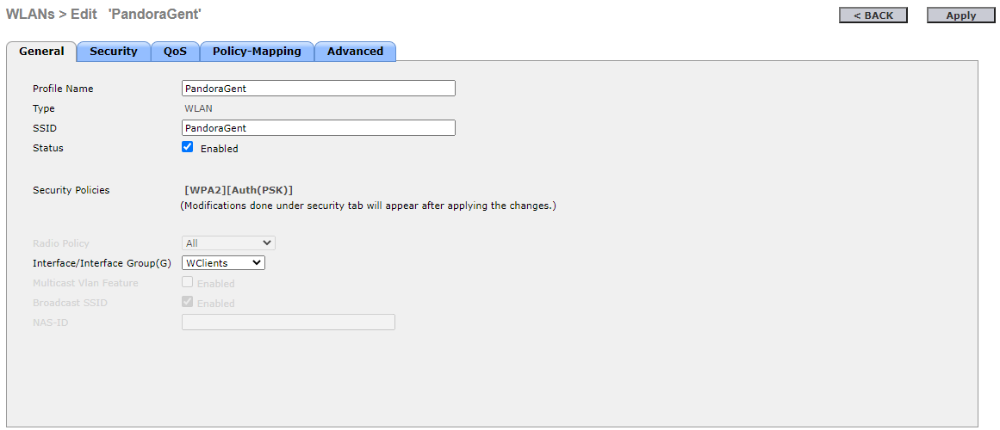
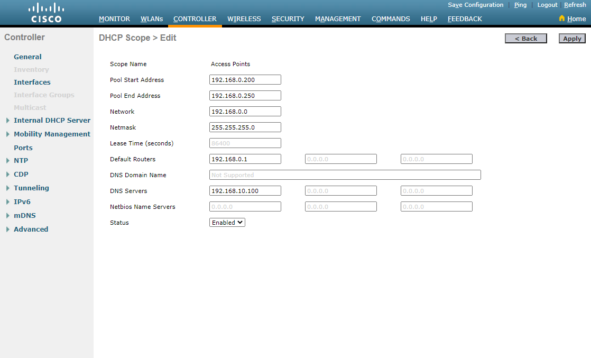

# Network Site Gent

The network at the site in Gent is the most complex. I will be explaining this step-by-step where I will cover most of the technologies used.

<figure><figcaption><p>Network Site Gent</p></figcaption></figure>

## VLAN's

I use VLAN to seperate the different networks from each other. It's just the same as on the server and used on the firewall to make rules.

```
SR-Switch01#show vlan

VLAN Name                             Status    Ports
---- -------------------------------- --------- -------------------------------
1    default                          active    Fa0/7, Fa0/8, Fa0/9, Fa0/12
                                                Fa0/13, Fa0/14, Fa0/15, Fa0/16
                                                Fa0/17, Fa0/18, Fa0/19, Fa0/22
                                                Fa0/23, Gig0/2
10   Gent-Servers                     active    Fa0/1, Fa0/2
15   Gent-Clients                     active    Fa0/6
16   Gent-DMZ-Servers                 active    Fa0/3, Fa0/4, Fa0/5
160  Gent-Wireless-Clients            active    
```

I used a L3 switch because I needed a default gateway for every VLAN in the network.

```
interface Vlan1
 ip address 192.168.0.1 255.255.255.0
!
interface Vlan10
 mac-address 00e0.f990.2301
 ip address 192.168.10.254 255.255.255.0
!
interface Vlan15
 mac-address 00e0.f990.2302
 ip address 192.168.15.254 255.255.255.0
 ip helper-address 192.168.10.100
!
interface Vlan16
 mac-address 00e0.f990.2303
 ip address 172.21.16.254 255.255.255.0
!
interface Vlan160
 mac-address 00e0.f990.2304
 ip address 192.168.16.254 255.255.255.0
 ip helper-address 192.168.10.100
```

## VTP

VTP stands for VLAN Trunking Protocol, a cisco protocol that makes it possible to advertise the VLAN's to all switches in that domain (VTP domain). On this network, the L3 switch is the VTP server with pandoraVTP as domain. The other switches in the network are both clients on that domain.


```
SR-Switch01#show vtp status 
VTP Version capable             : 1 to 2
VTP version running             : 1
VTP Domain Name                 : pandoraVTP
VTP Pruning Mode                : Disabled
VTP Traps Generation            : Disabled
Device ID                       : 0001.43BA.1000
Configuration last modified by 0.0.0.0 at 3-1-93 00:00:00
Local updater ID is 192.168.0.1 on interface Vl1 (lowest numbered VLAN interface found)

Feature VLAN : 
--------------
VTP Operating Mode                : Server
Maximum VLANs supported locally   : 1005
Number of existing VLANs          : 9
Configuration Revision            : 91
MD5 digest                        : 0x6E 0x87 0x88 0x7F 0x71 0xD1 0x92 0x75 
                                    0x37 0x9C 0xCF 0x7B 0xE1 0xEC 0xCE 0x60 
```


## STP & Port-channels

<figure><figcaption><p>Port channels vizualized</p></figcaption></figure>

As you notice; the network consists out of 4 switches where 3 of them are in a STP. I decided to have one switch at sales because of all the workstations connected and one in the meeting room because of the distance between the other switches. It was a great opportunity to make an STP and make port channels for redundancy; if one interface goes down, the other will work as a backup and vise-versa.

## Servers

In packet tracer its possible to have services running so the Site server hosts a site, the mail server is a SMTP & POP3 server and the DNS & DHCP server hosts those services.

<div>

<figure><figcaption><p>DHCP service</p></figcaption></figure>

 

<figure><figcaption><p>DNS service</p></figcaption></figure>

</div>

<div>

<figure><figcaption><p>Mail service</p></figcaption></figure>

 

<figure><figcaption><p>Site service</p></figcaption></figure>

</div>

## Wireless

The wireless network consists of 3 LWAP (Lightweight Access Points) and one WLC (Wireless Controller). The VLAN 160 (192.168.16.0/24) is used  to connect all the clients and the management of the wireless devices are just on the native vlan 1.

<figure><figcaption><p>Wireless interface VLAN 160</p></figcaption></figure>

<figure><figcaption><p>WLAN settings</p></figcaption></figure>

The WLC also has a DHCP pool for the LWAP's in the 192.168.0.0/24 range.

<figure><figcaption><p>Access Points DHCP pool</p></figcaption></figure>
