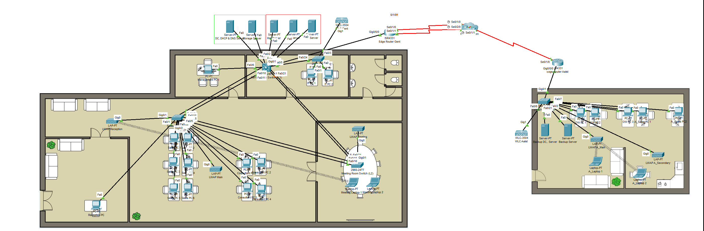
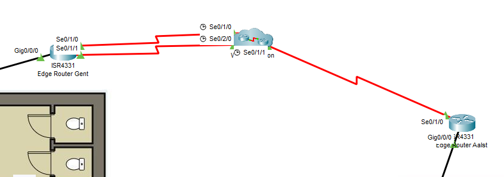
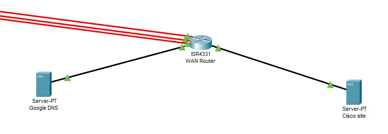

# Networking

I used packet tracer for emulating the network in both of the sites so it was an easy choice because I already had experience with the program and it allows to do all the things i needed. At first I imported the floorplans and from there on we could implement everyting.

The following picture is the full network topology including wireless and WAN emulation.

<figure><figcaption><p>Full network</p></figcaption></figure>

Because of the size and complexity of the network I decided to cut it down in 3 main parts:&#x20;

* WAN emulation and connection between the 2
* Site Gent
* Site Aalst

### WAN emulation & connection between the two sites

<figure><figcaption><p>WAN emulation / network</p></figcaption></figure>

The WAN is pretty simple; it consist of 2 edge routers each located in their site. They each connect to the WAN which is a cluster of 1 router and 2 servers: Google DNS (8.8.8.8) and a webserver cisco.net (66.5.88.76). These IP's are very important as they are not local addresses but, like in the real world, public addresses that can be pinged and searched by.

The edge routers have their own ISP lines to the WAN and have 2 main functions:

* They each do NAT; if a local workstation or server wants to connect to a public server it will translate that local IP to a public IP address that is staticly configured on that outgoing interface.
* Their is a IPSEC tunnel configured so it's made possible for both of the sites to communicate to one another. This is very important because they use the server on the other site (Gent uses the server in Aalst as a backup and Aalst uses the Gent servers as the main ones).

<figure><figcaption><p>WAN cluster</p></figcaption></figure>

The following picture is the running config of the edge router in Gent. You can see the IPSEC tunnel , the WAN interface and the extended access list needed to see which IP addresses needed to transfered via the tunnel.&#x20;

```
crypto isakmp policy 10
 encr aes
 authentication pre-share
 group 2
!
crypto isakmp key Hogent*123 address 82.55.20.4
!
!
!
crypto ipsec transform-set VPN-SET esp-3des esp-sha-hmac
!
crypto map VPN-MAP 10 ipsec-isakmp 
 description VPN connection to Aalst
 set peer 82.55.20.4
 set transform-set VPN-SET 
 match address IPSECGent
 ...
 ...
 interface Serial0/1/0
 ip address 5.88.21.112 255.255.255.0
 ip nat outside
 crypto map VPN-MAP
 ...
 ...
 ip access-list extended IPSECGent
 permit ip 192.168.15.0 0.0.0.255 192.168.25.0 0.0.0.255
 permit ip 192.168.10.0 0.0.0.255 192.168.25.0 0.0.0.255
 permit ip 172.21.16.0 0.0.0.255 192.168.25.0 0.0.0.255
 permit ip 192.168.15.0 0.0.0.255 192.168.20.0 0.0.0.255
 permit ip 172.21.16.0 0.0.0.255 192.168.20.0 0.0.0.255
 permit ip 192.168.10.0 0.0.0.255 192.168.20.0 0.0.0.255
 permit ip 192.168.16.0 0.0.0.255 192.168.20.0 0.0.0.255
 permit ip 192.168.16.0 0.0.0.255 192.168.25.0 0.0.0.255
 permit ip 192.168.16.0 0.0.0.255 192.168.26.0 0.0.0.255
 permit ip 192.168.15.0 0.0.0.255 192.168.26.0 0.0.0.255
 permit ip 192.168.10.0 0.0.0.255 192.168.26.0 0.0.0.255
 permit ip 172.21.16.0 0.0.0.255 192.168.26.0 0.0.0.255
```


We mostly set up the Serial 0/1/0 interface, although it has a backup interface because packet tracer has its limits. We can't use 2 interfaces or use a backup interface for both NAT and IPSec.


