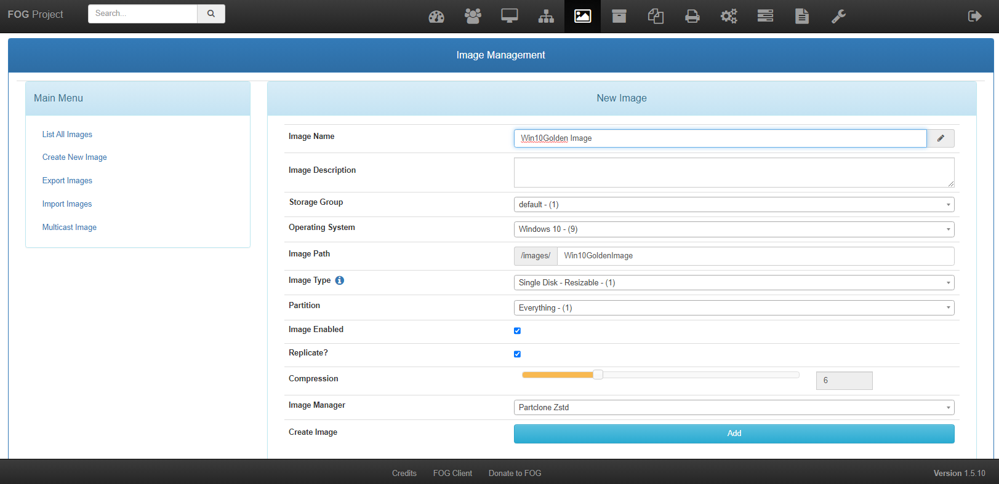

# Capturing the image

While it's possible to use the image immediately by creating a USB or CD, this method can become tedious and impractical when dealing with multiple computers. To streamline the process, we can use FOG to perform a PXE boot (network boot) on all devices. However, in order to utilize this feature, we must first capture the golden machine that was created in the previous step

First of, we create a image in the FOG GUI to store the actual image.

<figure><figcaption>
Creating a image FOG
</figcaption></figure>


PXE boot requires a DHCP server with the network booting setting enabled and the next server refering to the FOG server!


Then we power on the golden client and launch into PXE boot. We click "Perform Full Host Registration and inventory".

<figure><figcaption>
PXE GUI
</figcaption></figure>

 

<figure><figcaption>
PXE boot
</figcaption></figure>

Then we need to anwser some questions. The image capture progress and deploy of the image is done with the same setting and is just a little different.

Questions that will be asked:

* Enter the hostname for this computer (GoldenImages)
* Enter the image ID to associate with the computer (ENTER)
* Would you like to associate this host with groups? (N)
* Would you like to associate this host with snapins? (N)
* Would you like to… a product key to this host? (N)
* Would… Join a domain? (N)
* Enter the primary user for this computer (ENTER)
* Enter other tag #1 (ENTER)
* Enter other tag #2 (ENTER)
* Would you like to deploy the image to this computer now? (N)

The only difference is the last question. Capturing the image requires us to capture and NOT to deploy the image at this time. This is the option we will select when an image is available on the FOG Server.

Now the registration process is done. Time for the capture itself.\
We need to bind the golden client with the image in FOG. That way the FOG server knows when capturing the image we made earlier is bound to that client.

<figure><figcaption>
Binding image with client
</figcaption></figure>

We initiate the capture process.

<figure><figcaption>
FOG Initiate capture
</figcaption></figure>

When starting up the golden client again, the capture will automaticly start and after this you will see that the image will have grown in size (+-17GB). This will be used for the deployment itself.
