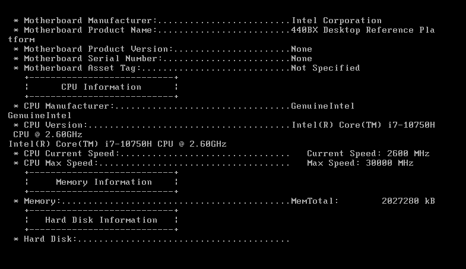
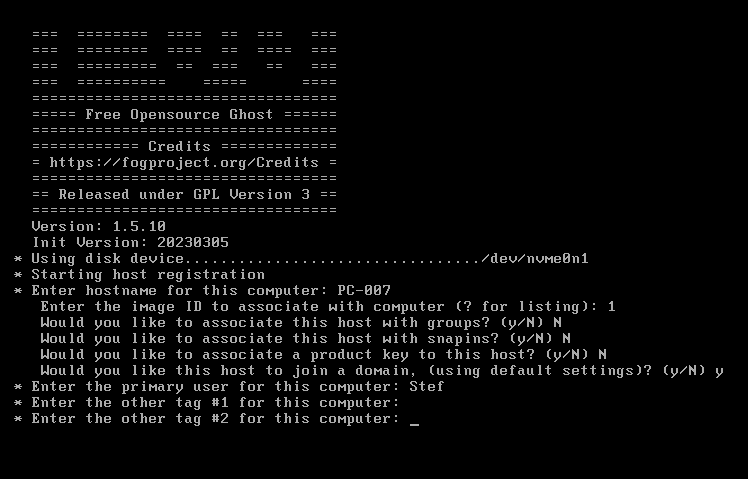
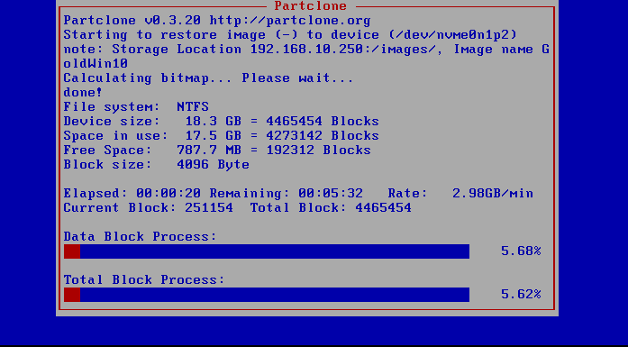

# Deploying the image

Deploying the image is straight forward. We start up a new client and boot it via PXE (network boot). This will give us the same options as when we captured the image.

<figure><figcaption>
Deployment CLI
</figcaption></figure>

 

<figure><figcaption>
Deployment Questions
</figcaption></figure>

<figure><figcaption>
FOG image transfer
</figcaption></figure>
