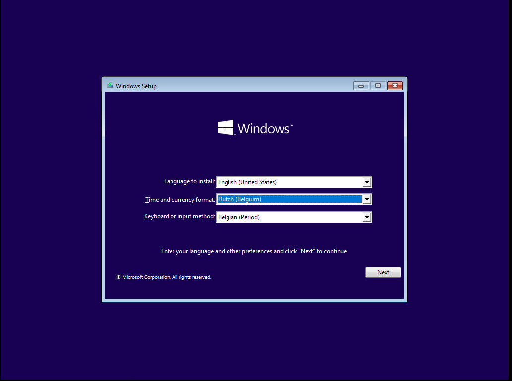
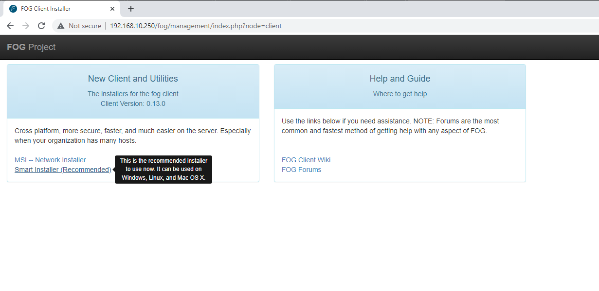
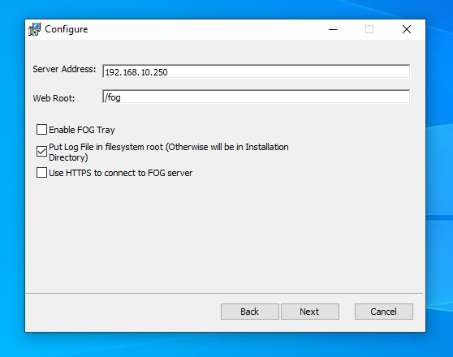
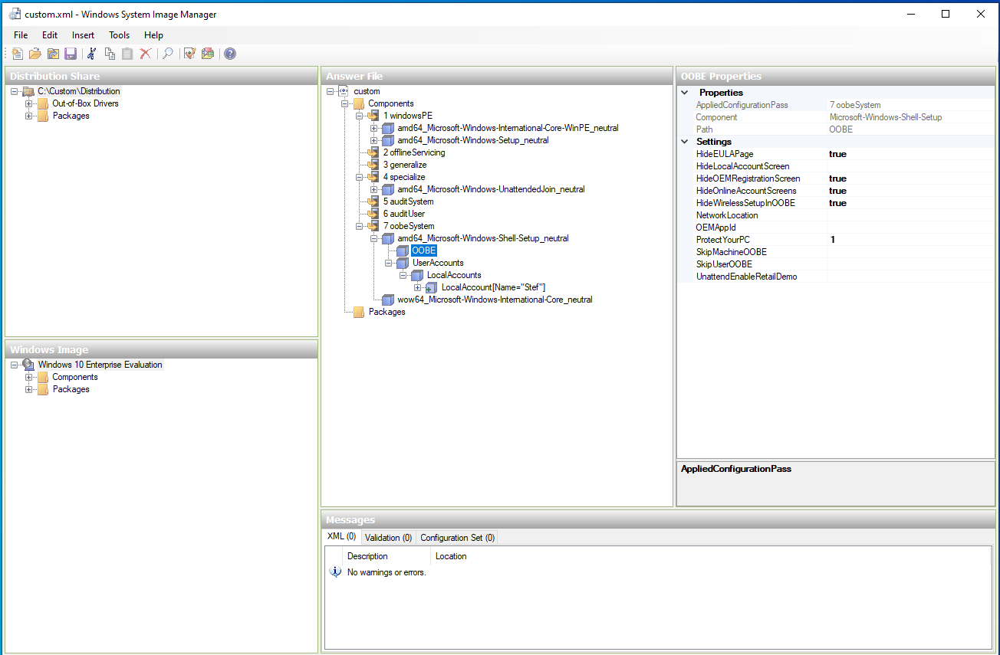

# Golden Image

A golden image is a pre-configured template of Windows 10 that is used as a standard for creating identical copies of OS clients. It serves as a baseline for consistent and efficient deployment.

This golden image will have a clean install of Windows 10 and 3 pre-installed programs (VLC, Putty and Google Chrome). We will deploy this image later. This section will focus on creating the image itself via FOG.

## Creating the image

Creating the image is pretty straight forward, we just set up a Windows 10 host that we can use to capture.

<figure><figcaption><p>Windows Setup</p></figcaption></figure>

When in OOBE, we press CTRL + SHIFT and then hit the F3 key. Windows will now reboot into Audit Mode. In Audit mode, the operating system runs in a state where the Windows Welcome screen is bypassed, and the computer is ready for customization and preparation.

Now we install the software we want, including the VMWare Tools.

* Google Chrome
* Putty
* VLC
* VMWare tools
* Windows ADK
* FOG Client

### FOG Client

The FOG client is a piece of software used in conjunction with the FOG imaging server to manage and automate the deployment of images and software packages to client machines. It allows for remote management and control of client machines, including the ability to deploy images, install software, and perform updates.

We download it by going to: http://FOGSERVERIP/fog/client

<figure><figcaption><p>FOG Client Installation</p></figcaption></figure>

<figure><figcaption><p>FOG Client Installation 2</p></figcaption></figure>

### Windows ADK

We will use Windows Deployment Tools, installed with Windows ADK to further create our image (on the VM, golden machine).

The Windows Deployment Tools wil help us to create an answer file, unattend.xml. This file will tell the installer what to do when installing Windows (skip OOBE, accept EULA, create local user, ...)

The image displays the settings for the unattend.xml file; however, reviewing each setting in detail would take us too deep into the topic. But I will include the XML file itself underneath the image.

<figure><figcaption><p>Windows System Image Manager</p></figcaption></figure>

```xml
<?xml version="1.0" encoding="utf-8"?>
<unattend xmlns="urn:schemas-microsoft-com:unattend">
    <settings pass="windowsPE">
        <component name="Microsoft-Windows-International-Core-WinPE" ...">
            <SetupUILanguage>
                <UILanguage>en-US</UILanguage>
            </SetupUILanguage>
            <InputLocale>en-US</InputLocale>
            <SystemLocale>en-US</SystemLocale>
            <UILanguage>en-US</UILanguage>
            <UserLocale>en-US</UserLocale>
        </component>
        <component name="Microsoft-Windows-Setup" ...">
            <DiskConfiguration>
                <Disk wcm:action="add">
                    <CreatePartitions>
                        <CreatePartition wcm:action="add">
                            <Order>1</Order>
                            <Size>500</Size>
                            <Type>Primary</Type>
                        </CreatePartition>
                        <CreatePartition wcm:action="add">
                            <Order>2</Order>
                            <Extend>true</Extend>
                            <Type>Primary</Type>
                        </CreatePartition>
                    </CreatePartitions>
                    <ModifyPartitions>
                        <ModifyPartition wcm:action="add">
                            <Active>true</Active>
                            <Format>NTFS</Format>
                            <Label>System</Label>
                            <Order>1</Order>
                            <PartitionID>1</PartitionID>
                        </ModifyPartition>
                        <ModifyPartition wcm:action="add">
                            <Format>NTFS</Format>
                            <Label>Windows</Label>
                            <Letter>C</Letter>
                            <Order>2</Order>
                            <PartitionID>2</PartitionID>
                        </ModifyPartition>
                    </ModifyPartitions>
                    <DiskID>0</DiskID>
                    <WillWipeDisk>true</WillWipeDisk>
                </Disk>
                <WillShowUI>OnError</WillShowUI>
            </DiskConfiguration>
            <ImageInstall>
                <OSImage>
                    <InstallTo>
                        <DiskID>0</DiskID>
                        <PartitionID>2</PartitionID>
                    </InstallTo>
                </OSImage>
            </ImageInstall>
            <UserData>
                <ProductKey>
                    <Key>NPPR9-FWDCX-D2C8J-H872K-2YT43</Key>
                </ProductKey>
                <AcceptEula>true</AcceptEula>
                <Organization>Pandora</Organization>
            </UserData>
        </component>
    </settings>
    <settings pass="specialize">
        <component name="Microsoft-Windows-UnattendedJoin" ...">
            <Identification>
                <Credentials>
                    <Domain>pandora.local</Domain>
                    <Password>Hogent*123</Password>
                    <Username>Administrator</Username>
                </Credentials>
                <JoinDomain>pandora.local</JoinDomain>
            </Identification>
        </component>
    </settings>
    <settings pass="oobeSystem">
        <component name="Microsoft-Windows-International-Core" ...">
            <InputLocale>en-US</InputLocale>
            <SystemLocale>en-US</SystemLocale>
            <UILanguage>en-US</UILanguage>
            <UserLocale>en-US</UserLocale>
        </component>
        <component name="Microsoft-Windows-Shell-Setup" ...">
            <OOBE>
                <HideEULAPage>true</HideEULAPage>
                <HideOEMRegistrationScreen>true</HideOEMRegistrationScreen>
                <HideOnlineAccountScreens>true</HideOnlineAccountScreens>
                <HideWirelessSetupInOOBE>true</HideWirelessSetupInOOBE>
                <ProtectYourPC>1</ProtectYourPC>
            </OOBE>
            <UserAccounts>
                <LocalAccounts>
                    <LocalAccount wcm:action="add">
                        <Password>
                            <Value>SABvAGcAZQBuAHQAKgAxADIAMwBQAGEAcwBzAHcAbwByAGQA</Value>
                            <PlainText>false</PlainText>
                        </Password>
                        <Description>Admin local account</Description>
                        <DisplayName>Stef</DisplayName>
                        <Group>Administrators</Group>
                        <Name>Stef</Name>
                    </LocalAccount>
                </LocalAccounts>
            </UserAccounts>
        </component>
    </settings>
    <cpi:offlineImage cpi:source="wim:c:/custom/win10/sources/install.wim#Windows ..." />
</unattend>

```

### Running Sysprep <a href="#part-8-running-sysprep" id="part-8-running-sysprep"></a>

Now the golden client is ready, it's time to take a sysprep as last step. Opening CMD for this.

```sh
cd c:\Windows\System32\Sysprep
```

Doing the sysprep, generalizing and shuting down. We refer to the unattend file we just made for the installation.

```sh
sysprep.exe /generalize /oobe /shutdown /unattend:C:\customize\customize.xml
```
