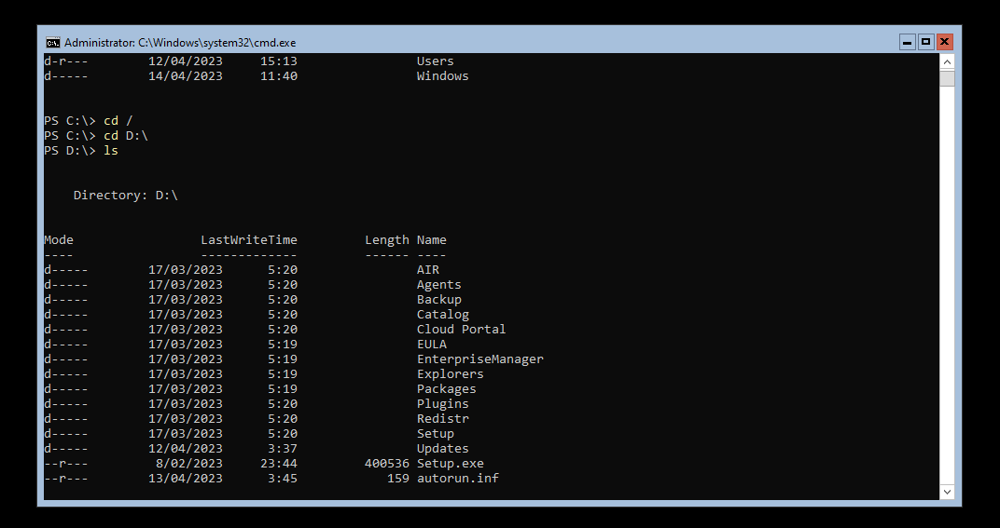
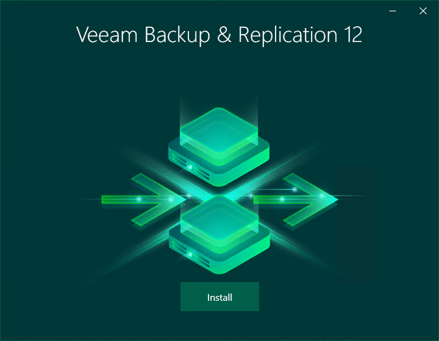
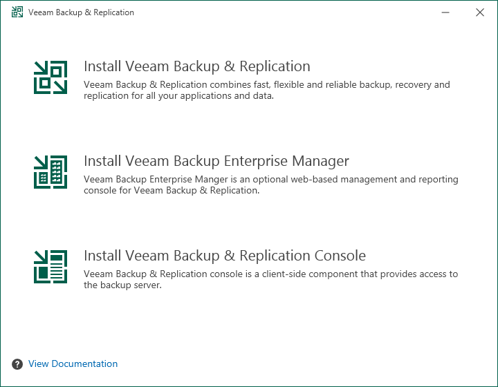

# Backup

For the backups and backup jobs we will be using Veeam. Veeam Backup and Replication is widely recognized as the industry standard for backup and recovery solutions, trusted by over 400,000 customers worldwide.

## Setting up the VM

The VM for running a Windows Server 2022 Core that hosts Veeam Backup and Replication has following hardware;

* 2 CPU
* 4 GB RAM
* 60GB HARD DISK + 50GB 2TH HARD DISK

Installing Veeam on a Windows Core Server is pretty straight forward. We just attach the ISO downloaded from the Veeam site to the server and run the setup.exe. This opens up the install GUI.

<figure><figcaption>
Veeam ISO in the Core server via cmd
</figcaption></figure>

<figure><figcaption>
Install GUI Veeam
</figcaption></figure>

<figure><figcaption>
Installing Veeam Backup &#x26; Replication on this server
</figcaption></figure>

From here on out, the installation is pretty straight forward. On this server we will install the backup & replication server itself. Afterwards, setting up the server and jobs itself will be happening from one of the AD servers with the Veeam console.
