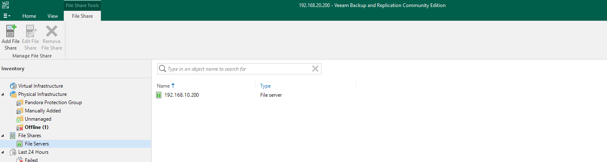

# Repo's and jobs


Because of hardware limitations (hard disk space), we are using veeam only to backup the file shares and not the VM's or make use of archiving.


For Veeam to work, we need repository's (where to store the backups), the server and file shares to backup and the jobs (the connection between what to backup where and when).

We set this up via the Veeam console on one of the AD servers. When launching the console we make connection to the backup server itself.

<figure><figcaption>
Veeam Console
</figcaption></figure>

## Repository's

First we will make 2 repository's.

* One will be located on a separate drive in the backup server; called the 'On-Prem Repository'
* The other one will be the NAS (Windows Server Share on the File Server)

<figure><figcaption>
Veeam Repository's
</figcaption></figure>

## Protection Group and File Shares

Next up we'll be connecting the servers with Veeam. This means that Veeam is able to connect to the server in our infrastructure and make a full or partial backup of them.

<figure><figcaption>
Veeam connected servers
</figcaption></figure>

And because we are working with File Shares we'll also be adding them to Veeam. This makes backing up the file shares itself much easier. The specified shares to back up is available when creating a job. When pointing to them is done by specifing a File Server.

<figure><figcaption>
Veeam File Servers
</figcaption></figure>

## Jobs

Now the final part: jobs. This will make everything come together as one part.

When creating a job, we have the option to backup the following:

<figure><figcaption>
Veeam Backup options
</figcaption></figure>

We only want to backup out file shares for now. After selecting this we're able to choose which shares/folders to backup exactly.

<figure><figcaption>
Veeam File Share backup job
</figcaption></figure>

Then we need to specify where to backup to:

<figure><figcaption>
Veeam specifying backup repo
</figcaption></figure>

Veeam also gives the option to archive, we're skipping this for now.
