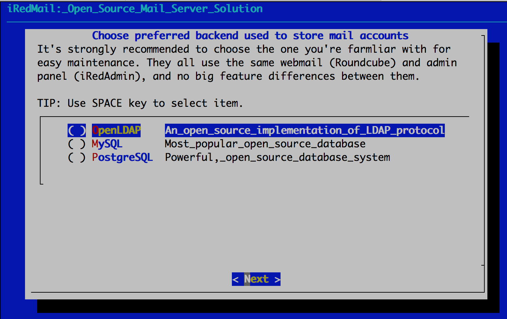

# Mail

I wanted to have a reliable and secure mailing system and hosted on-prem. Again, I choose a Ubuntu environment. This is a more complex setup than a normal M365 exchange online setup but far more interesting as setup and debugging goes.

## Setting up the VM

The VM for running a Ubuntu 22.04 server that hosts iRedMail has following hardware;

* 1 CPU
* 2 GB RAM
* 10GB HARD DISK

iRedMail is an open-source email server solution that provides a complete mail system that includes mail server, webmail client, and other components necessary for mail communication. It provides a simplified process of setting up and managing an mail server.

iRedMail consist out of 3 major components that work together:

* Postfix: It is the mail transfer agent (MTA) responsible for sending and receiving email messages.
* Dovecot: It is the email delivery agent (MDA) that stores and manages user mailboxes.
* Roundcube: It is a webmail client that allows users to access and manages user mailboxes.

These are the 3 main components that are present. But it's important to know it's not all, you also have Amavisd-new, ClamAV, SpanAssassin and OpenLDAP. The will not be mentioned in this documentation and will not be used in my project (except for OpenLDAP).

After downloading iRedMail via tar, we execute the tar file to start the setup.

```vim
cd /root/iRedMail-x.y.z/
bash iRedMail.sh
```

The installation is pretty simple because its a GUI. No comands needed for now.

<figure><figcaption><p>Welcome message</p></figcaption></figure>

Specifying the location for storing the mailbox, we just choose the default one because this server is dedicated to mailing only.

<figure><figcaption><p>Default Mailbox location</p></figcaption></figure>

Because our user accounts are created and stored on the ADUC we will syncronize those to the mail server. It's easier to syncronize accounts versus creating a account on every single system.

Let's say you work at a company that has 50 employees, each with their own computer and mail account. Without synchronization, you would need to manually create an mail account for each employee on each computer, which can be time-consuming and prone to errors.

Because of the setup, we choose to use OpenLDAP backend other than a seperate database to store the accounts.

<figure><figcaption><p>Choosing a backend</p></figcaption></figure>

LDAP suffix will be "dc=pandora,dc=local".

<figure><figcaption><p>LDAP Suffix</p></figcaption></figure>

After the installation we will be able to login onto the Roundcube client, SoGo Groupware and Web admin panel (iRedAdmin).
