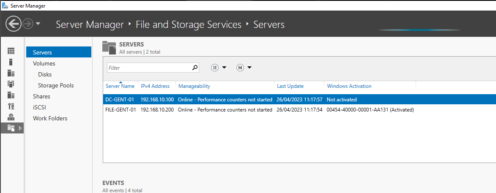
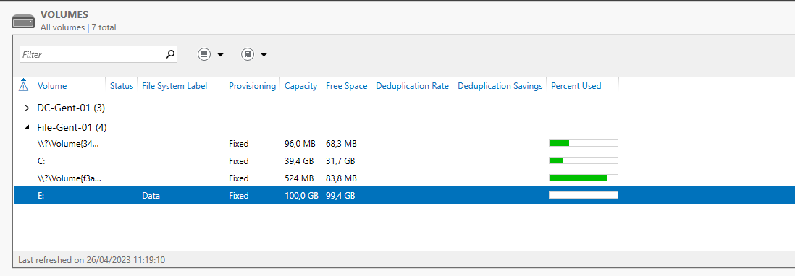
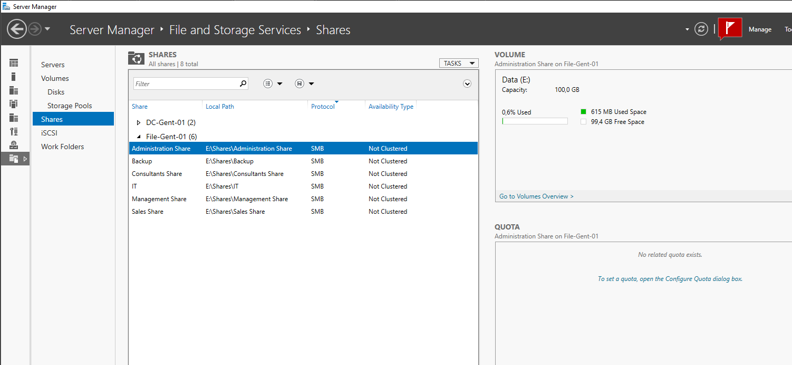

# Storage

I had a few options regarding file sharing: Onedrive, Truenas, Synology, ... . I ended up creating another Windows Server with File Shares. This is a simple solution for users to access and share files.

The best practice is to make a seperate server that only acts as the file server, so I chose a Windows Server 2022 Core to host this. The file services will be configured using one of the AD servers

<figure><figcaption>
Storage Server from AD
</figcaption></figure>

## Setting up the VM

The VM for running a Windows Server 2022 Core server that hosts the file sharing services has following hardware;

* 1 CPU
* 1 GB RAM
* 40GB HARD DISK + 100GB 2TH HARD DISK

All file shares will be located on the 2th disk of 100 GB. This drive will be mapped as E:\\.

<figure><figcaption>
E:\ drive on the file server
</figcaption></figure>

I created a share folder for every department and a seperate backup share that will be used by Veeam for placing backups on the Gent site.

<figure><figcaption>
File Shares
</figcaption></figure>

This is in short how I set up the file server.
