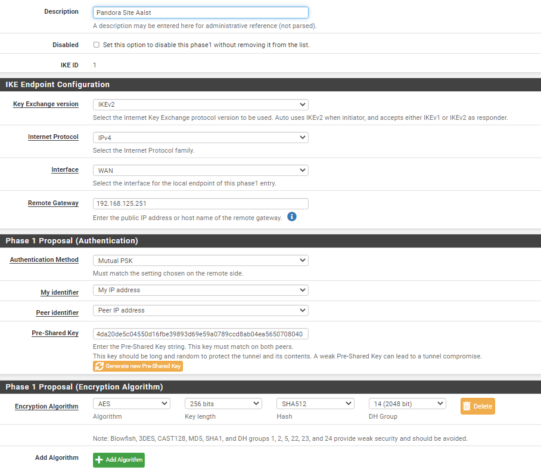

# Setting up the IPSec Tunnel

This VPN Tunnel will allow us to connect the servers/clients/DMZ services from Gent to Aalst and vice versa as it was an local device.

Setting the IPSec Site-to-Site Tunnel up, was pretty straight forward, but requires a few screenshots for explination

<figure><figcaption>
Firewall Aalst IPSEC summary
</figcaption></figure>

The image above is the IPsec tunnel config in Aalst. On top you see the Phase 1, this makes the connection to the site in Gent that is on WAN ip 192.168.125.250 (Remote gateway) and we'll use an AES 256 bit encryption which is considered safe.

And underneath the phase 1, you see 2 phase 2 entries. The first one is the tunnel for the whole local network at Aalst; when subnetting it becomes 192.168.16.0/20; to the remote netwerk at Gent's clients and servers, again; when subnetting it becomes 192.168.0.0/20.

The second phase 2 entry is for all Aalst devices to the DMZ servers in Gent. We choose for 2 seperate entries because subnetting the 2 networks together would become to big of a network and would maybe create a security risk.

<figure><figcaption>
Firewall Gent IPSEC summary
</figcaption></figure>

Next is the IPsec tunnel config in Aalst, this is pretty much the same expect that it's just the other way around. The phase 1 entry would make a connection to the Aalst site with WAN address 192.168.125.251.

The other 2 phase 2 entries would make a tunnel; both to the subnet 192.168.16.0/20 (Clients & Servers in Aalst) for the clients and servers in Gent and one for the DMZ.

The next screenshots are the configurations of each of those phases, for both sites.

<figure><figcaption>
Phase 1 configuration in Aalst
</figcaption></figure>

 

<figure><figcaption>
Phase 1 configuration in Gent
</figcaption></figure>

<figure><figcaption>
Phase 2; Entry 1 in Aalst
</figcaption></figure>

 

<figure><figcaption>
Phase 2; Entry 2 in Aalst
</figcaption></figure>

<figure><figcaption>
Phase 2; Entry 1 in Gent
</figcaption></figure>

 

<figure><figcaption>
Phase 2; Entry 2 in Gent
</figcaption></figure>

