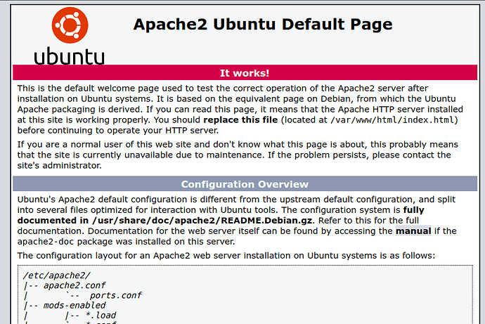
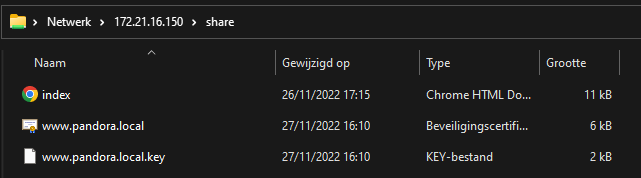

# Site

Next up is the site. I used apache as it is the most used web server in the world till date; easy to use, customizable and vast library of resources. And again, Linux is very stable and reliable.


I started with the 'small' servers being: Mail, Web, CA and Firewall because it was the true core of the project. Before those were made, the Active Directory was already made. But that will be a next topic.


## Setting up the VM

The VM for running a Ubuntu 22.04 server that hosts apache has following hardware;

* 1 CPU
* 2 GB RAM
* 10GB HARD DISK

Installing Ubuntu 22.04, again, very straight forward by now. Apache is installed by running following command

```shell
sudo apt install apache2
```

After this we are already able to browse to the site and receive following HTML

<figure><figcaption><p>Standard apache website</p></figcaption></figure>

And, we know it works! We just want the site to show something about the company itself. All of the HTML/CSS/JS code we can drop into the default folder /var/www. There will be an index.html file already, this is the default code, we can just replace this.

In order for easy management and being able to easlly transfer html/css/js files, I installed samba so I could browse the var/www folder from my windows machine.

```shell
sudo apt install samba
sudo vim /etc/samba/smb.conf
```

In the /etc/samba/smb.conf we can find the samba configuration file. In this file we can make a new share. We connect this share directly to the /var/www/html folder.

```
[share]
   comment = Share
   path = /var/www/html
   browsable = yes
   read only = no
```

Now we can go to this share with a windows machine connected to the network.

<figure><figcaption><p>Samba share accessed from windows machine</p></figcaption></figure>

I ilmported custom files with the new webpage that I generated using an online tool.

<figure><figcaption><p>New files (generated)</p></figcaption></figure>

<figure><figcaption><p>New site</p></figcaption></figure>
