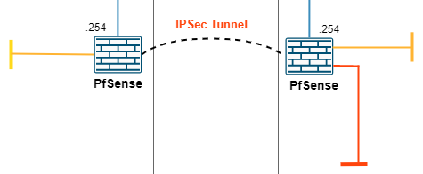
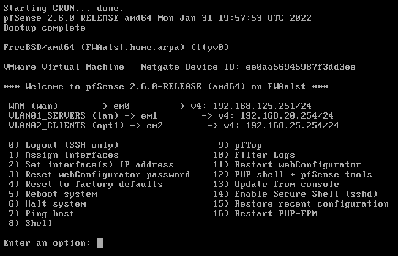
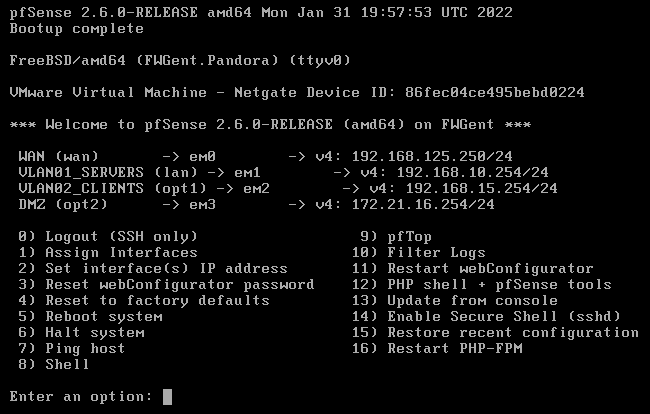
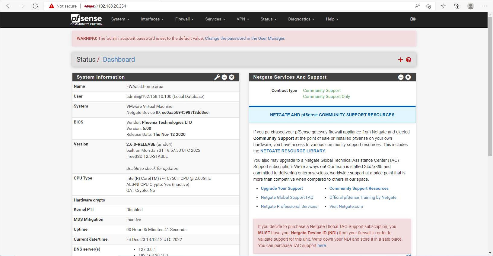
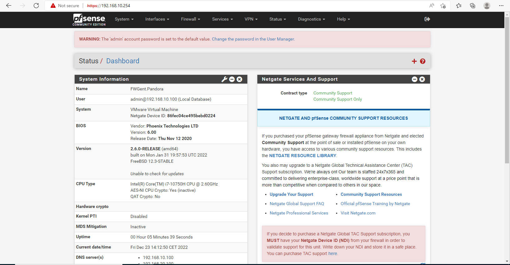

# The Firewall

I've chosen PFSense as firewall because of a few reasons; it will run on Linux/FreeBSD which is very solid and doens't require alot of hardware. PFSense also gives me the services I need: IPSec VPN and rules. The only downside is that it isn't a Next-Gen firewall. It doesn't give me the ability to make blocking rules based on application.

I started with setting up both the PFSense firewalls including: Setting up the VM's, configuring the interfaces, setting up VPN and the rules.

<figure><figcaption>
Firewall's on the Diagram
</figcaption></figure>

I kept a few things in mind when setting them up, including the 3 zones:



* Clients - 192.168.15.0/24
* Servers - 192.168.10.0/24
* DMZ - 172.21.16.0/24



* Clients - 192.168.25.0/24
* Servers - 192.168.20.0/24



All of the default gateway addresses ended with .254, the last IP in every range. So it was easy to remember for each subnet.

## Setting up VM

After considering the hardware, I ended up with the following hardware:

* 1 CPU
* 512MB RAM
* 8GB HARD DISK

I also connected all of the network adapters needed for the lab that I made in VMware workstation.

The installation of pfsense itself is pretty straight forward and easy. Choosing IP adresses, name, DNS, language, ... . PFSense sets up the entire system and from the beginning we're able to work with the web interface if needed. This makes it much easier to create rules and create a IPsec tunnel. The screenshots are made after setting up all of the interfaces, and the webinterfaces:

<figure><figcaption>
Firewall Aalst
</figcaption></figure>

 

<figure><figcaption>
Firewall Gent
</figcaption></figure>

<figure><figcaption>
Webinterface Aalst
</figcaption></figure>

 

<figure><figcaption>
Webinterface Gent
</figcaption></figure>

