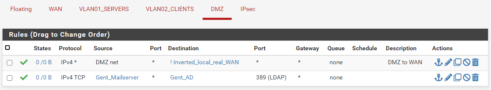

# Making the rules

Now both of the PFSense VM's are set up and the IPsec tunnel is created. But we still can't send any traffic because we didn't set rules. Rules are nessesary for traffic to be send accross subnets.

We could make one rule that allows all traffic from all protocols to be send accross the network. It would work and is very usefull when testing for example, the IPSec tunnel, which I did. But when it comes to security, we need to specify which devices can send to which and on what protocol.

At first hand I didn't focus on protocols (by port number) because I didn't know what ports I needed for what service and I also wanted to rule out a possible firewalling problem when testing mail, ca, ... .

I first started with 2 sketches:

<figure><figcaption>
Firewall rules sketch Aalst
</figcaption></figure>

The following sketch displays the rules as simply as possible:

* The client can contact the following servers: Servers in Aalst; for services that were hosted there (Backup, Backup AD), Servers in Gent; for the main AD, NAS, DNS and the DMZ which houses the mail, site and CA server.
* The servers on their end can contact: The clients in Aalst, the clients in Gent; for both requesting information when needed and the DMZ; for making backups etc.

<figure><figcaption>
Firewall rules sketch Gent
</figcaption></figure>

In Gent we have the following:

* The clients can contact: The servers and DMZ in Gent all of the needed services, the servers in Aalst for backups and backup AD and most important, the WAN for internet connectivity.
* The servers can contact: The clients and DMZ; the servers in Aalst (backup AD) and the client in Aalst
* Note that the DMZ can only create a connection to the WAN and can't make one to the servers or clients. Only they can innitiate a connection.

For security reasons both the servers in Aals & Gent have no connection to the outside world / WAN!

<figure><figcaption>
Rules Gent: WAN interface
</figcaption></figure>

<figure><figcaption>
Rules Gent: Servers VLAN interface
</figcaption></figure>

<figure><figcaption>
Rules Gent: Clients VLAN interface
</figcaption></figure>

<figure><figcaption>
Rules Gent: DMZ interface
</figcaption></figure>

<figure><figcaption>
Rules Gent: IPsec interface
</figcaption></figure>

<figure><figcaption>
Rules Aalst: Servers interface
</figcaption></figure>

<figure><figcaption>
Rules Aalst: Clients interface
</figcaption></figure>

<figure><figcaption>
Rules Aalst: IPsec interface
</figcaption></figure>

Note: the inverted\_local\_real\_WAN is the made because the 'WAN' address is the NAT interface from VMware workstation (192.168.125.0/24).
