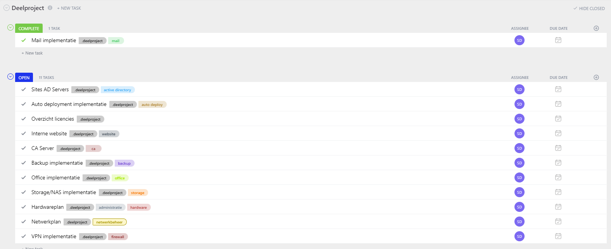

# The Plan

So, previous step I asked myself a lot of questions; and that created a plan, this plan.

At the top of the document there was a little story that I didnt need to worry about; I have a name and it will be discoverable on Google. Harsh to say but, I didn't really have anything to worry about the 'workstation count' because the clients and users are one of the last things I would make since I will use test users at first.

## Using Linux

When looking at the requirements themselves: i wanted to begin with the server side of this project, it will take up most of the time. I wanted to use as much Linux servers as possible because they are very reliable and don't use a lot of hardware. The full project will run on my laptop, so it is very important to think ahead.

## Server list

A list of the servers and software on it:

* All of the client devices will run on Windows 10/11
* Firewalls will run on FreeBSD with PFsense
* Active Directory and DNS (Ghent and Alost) will run on Windows Server 2022
* Storage server will run on Ubuntu 22.04 with TrueNAS
* Mail server will run on Ubuntu 22.04 with iRedMail
* Site server will run on Ubuntu 22.04 with Apache
* Certificate Authority server will run on Ubuntu 22.04 with OpenSSL
* Backup server in Alost will run on Ubuntu 22.04 with Borg

## Keeping track of the tasks

For keeping track of all the tasks I came across an online program named 'Clickup'. It has a board and list view, I can track my time and create tags. Enough possibilities.

I divided all of the big tasks into 'milestone' tasks:

<figure><figcaption>
Milestones or part project
</figcaption></figure>

The tasks include:

* Mail implementation
* Sites AD Servers
* Auto Deployment implementation
* List licences
* Internal website (intranet)
* Certificate Authority
* Backup implementation
* Office implementation
* Storage/NAS implementation
* VPN implementation
* Hardware plan
* Networking plan

So now I had converted the whole document into subparts, it was time to make smaller parts that I could handle

<figure><figcaption>
The subtasks
</figcaption></figure>

The moment I choose a milestone, I created subtasks for it. As example: Firewall would be split up into smaller parts: creating the server, setting up, creating FW rules, making VPN connection, ... .

As you see, when creating a subtask I tagged them with the appropriate tags. Example: Creating PFsense Ghent would get the tag Firewall and system so I can later search on tagname when nessesary.
